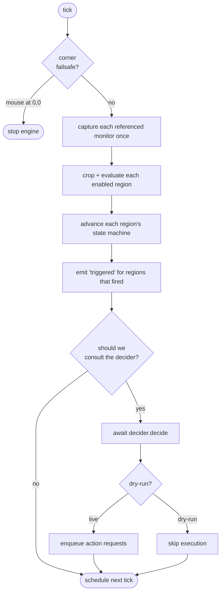

# The engine

The engine lives in `packages/core` and is the heart of autopoker: a timed loop that captures screens, evaluates regions, and hands decisions to a decider. It's written entirely against interfaces, so it runs identically with real native adapters or with test fakes.

## The tick loop

`MonitoringEngine` schedules ticks with a **chained `setTimeout`, never `setInterval`**. The next tick is scheduled only after the current one fully completes, so a slow capture — or, in LLM mode, a slow model call the engine awaits — can never overlap the next tick.

One tick, start to finish:



Monitors are captured **once per tick** even if several regions share one, then each region is cropped from its monitor's frame in pure TypeScript.

## The region state machine

Each region carries a small runtime state machine that turns a stream of per-tick match booleans into discrete trigger events. Phases: `armed → confirming → cooldown → armed`.

- **armed / confirming** — counts consecutive matches. On reaching `confirmTicks`, the region _triggers_ and moves to `cooldown`. A single non-matching tick resets the count.
- **cooldown** — after triggering, holds until `cooldownMs` has elapsed. The **re-arm policy** decides the rest:
  - `afterCooldown` — time only; can re-fire while the condition is still true.
  - `afterConditionClears` — time elapsed _and_ at least one non-matching tick seen, so a permanently-visible target fires once.

This is the same machine documented for users in [Manual mode](/guide/manual-mode); the source is `advance()` in `engine.ts`.

## Deciders

After evaluation, the engine asks a **decider** what to do. The interface is deliberately tiny:

```ts
interface DeciderInput {
  tick: number;
  now: number;
  evaluations: RegionEvaluation[];
  frames: Map<string, Frame>; // full monitor frames this tick
}

interface Decider {
  decide(input: DeciderInput): ActionRequest[] | Promise<ActionRequest[]>;
}
```

`decide` may be async — that's what lets the LLM decider await a model call inside the tick. The return is a list of `ActionRequest`s, each a self-contained sequence of steps with resolved coordinates.

### The rule decider

`RegionRuleDecider` is manual mode: it reads only `evaluations`, and every region that _triggered_ this tick becomes one `ActionRequest` (its own action list, targeted at its centre via the coordinate mapper). It's synchronous and never looks at the frames.

### The LLM decider

`LlmDecider` is LLM mode. It's covered in depth in [the LLM pipeline](./llm), but from the engine's point of view it's just another `Decider` — it happens to return a promise while it captures, calls a model, and translates the result.

### When the decider runs

`shouldDecide()` gates consultation:

- **manual mode** — whenever any region triggered this tick.
- **LLM mode** — subject to the `minIntervalMs` rate limit, then either every tick (`llmTrigger: 'everyTick'`) or only when a region triggered (`'onRegionTrigger'`).

In **dry-run**, the decider still runs — so the UI shows what _would_ happen — but the returned requests are not enqueued.

## The action queue

`ActionQueue` implements `ActionQueueLike`: a serial async FIFO.

- One `ActionRequest`'s entire step list runs to completion before the next starts. Mouse moves never interleave.
- A **depth cap** (default 1) means that while the queue is busy, new requests are _dropped_, not buffered — no trigger storm can build up a backlog. The engine logs the drop.
- `clear()` empties pending work (used by the kill switch).

Each step is executed by an `ActionExecutor`, guarded by a callback that re-checks the kill switch and corner failsafe **before every step**.

## Coordinate mapping

Regions are stored in **capture pixels** relative to their monitor. `ScaledCoordinateMapper` converts a capture-space point to the OS virtual-screen coordinates robotjs expects: it adds the monitor's origin and applies the capture-to-logical scale factor. This handles multi-monitor layouts (including monitors at negative coordinates) and high-DPI displays. The mapping was pinned down empirically during the native spike and is isolated to this one class.

## Safety hooks in the loop

- **Corner failsafe** — checked at the top of every tick and before every action step. Pointer within 5px of (0,0) stops the engine.
- **Kill switch** — a global hotkey (via `uiohook-napi`) that stops the engine and clears the queue from any application.
- **Single call in flight** — because the engine awaits `decide()` and never overlaps ticks, at most one model call exists at a time.

## Testing the engine

Because everything is an interface, the engine's tests use fakes — a scripted `FakeCapturer`, a `RecordingExecutor`, a `RecordingInput` — with Vitest's fake timers. This exercises debounce, cooldown, both re-arm policies, dry-run suppression, the queue depth cap, the corner failsafe, and (in `engine-llm.test.ts`) the LLM trigger and rate-limit gating — all with no native code and no real clock.
