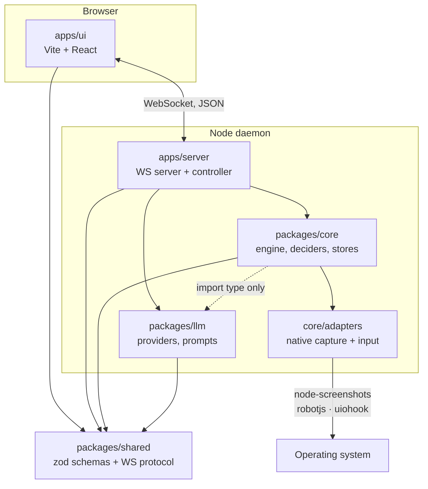

# Architecture

autopoker is an npm-workspaces monorepo in TypeScript. This page is the map; the rest of the developer guide drills into each part.

## The big picture

## Packages

| Package                      | Responsibility                                                                                                                                                                                                                            | Depends on               |
| ---------------------------- | ----------------------------------------------------------------------------------------------------------------------------------------------------------------------------------------------------------------------------------------- | ------------------------ |
| **`packages/shared`**        | zod schemas for every config object (profiles, regions, conditions, actions, strategies, LLM settings) and the WebSocket protocol. Browser-safe — no Node APIs.                                                                           | zod                      |
| **`packages/core`**          | The engine and its logic: capture/input interfaces, condition evaluators, the region state machine, the action queue, the coordinate mapper, both deciders, and the disk stores. Pure and unit-testable.                                  | shared; llm (types only) |
| **`packages/core/adapters`** | The only place native modules are touched: screen capture (`node-screenshots`), mouse/keyboard (`@hurdlegroup/robotjs`), and the global hotkey (`uiohook-napi`). Behind a subpath export so tests and the UI never load `.node` binaries. | native libs              |
| **`packages/llm`**           | Everything model-related: the provider registry over the Vercel AI SDK, prompt assembly, PDF text extraction, the mock source, and the connection probe.                                                                                  | shared, AI SDK           |
| **`apps/server`**            | The daemon: WebSocket server, the message router (`handlers`), the engine controller wiring everything together, and the preview publisher. The only place adapters are instantiated.                                                     | core, llm, shared, ws    |
| **`apps/ui`**                | Vite + React. Live previews, region editor, strategy editor, model panel, event log. Imports only `shared`.                                                                                                                               | shared, react            |
| **`docs`**                   | This VitePress site.                                                                                                                                                                                                                      | vitepress                |

## Load-bearing boundaries

A few boundaries are deliberate and worth preserving:

- **`shared` is browser-safe.** It's the one package both the UI and the daemon import, so it must never touch Node APIs. Schemas and types only.
- **`core` never loads the AI SDK at runtime.** It depends on `packages/llm` only through `import type`, so in manual mode — and in every unit test — no model code is loaded. The engine talks to models through a single `DecisionSource` interface.
- **Native code lives only in `core/adapters`.** The engine is written against interfaces (`ScreenCapturer`, `InputController`, `CoordinateMapper`), and the adapters are the sole implementors that touch `.node` binaries. This is what lets the whole engine be tested with fakes.
- **`apps/server` is the only instantiator of adapters.** Everything native is constructed there and injected down.

## No build step for internal packages

Internal packages export their TypeScript source directly (`"exports": { ".": "./src/index.ts" }`). The server runs under `tsx`, the UI bundles through Vite, and Vitest consumes TypeScript natively — so there's no `tsc` build orchestration between packages. Type-checking is a separate `tsc --noEmit` gate per package.

## Request lifecycle at a glance

1. The UI opens a WebSocket to the daemon and sends typed [protocol](./protocol) messages.
2. `apps/server`'s message router (`handlers.ts`) validates each message against the shared schema and calls into the engine controller or a store.
3. The [engine](./engine) ticks on a timer, capturing via an adapter and evaluating regions.
4. Depending on mode, a decider ([rule-based](./engine#the-rule-decider) or [LLM](./llm)) produces action requests.
5. Executed actions and state changes are broadcast back to every connected UI as protocol events.

From here:

- **[The engine](./engine)** — the tick loop, region state machine, action queue, and coordinate mapping.
- **[The LLM pipeline](./llm)** — providers, prompt building, decision translation.
- **[WebSocket protocol](./protocol)** — the full message catalogue.
- **[Storage & data](./storage)** — how profiles, baselines, and strategies live on disk.
- **[Extending autopoker](./extending)** — adding a provider, condition, action, or decider.
- **[Development workflow](./workflow)** — running, testing, and the quality gate.
