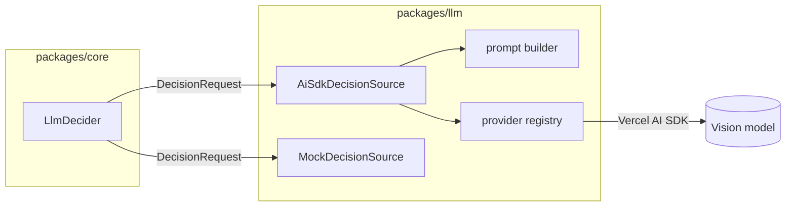

# The LLM pipeline

Everything model-related lives in `packages/llm`, behind a single interface the engine depends on. This page traces a decision from tick to executed step.

## The seam: `DecisionSource`

`packages/core` depends on `packages/llm` **only through `import type`**. The one runtime contract is:

```ts
interface DecisionSource {
  decide(request: DecisionRequest): Promise<DecisionResult>;
}
```

A `DecisionRequest` carries the resolved settings, the strategy context (markdown + attachment bytes), the screenshots, the landmarks, recent history, and the names of regions that just triggered. A `DecisionResult` carries the validated `LlmDecision`, latency, model id, and token usage.

This seam is why an LLM decider can slot into the engine without the engine knowing anything about the AI SDK, and why the whole thing is testable with a mock.

## The two sides



- **`LlmDecider`** (in `core`) orchestrates: it builds the request, calls the source, translates the answer into engine actions, and enforces safety limits. Screenshot selection: enabled **view regions win** — each becomes a cropped screenshot (labelled with the region's name, carrying its capture-space origin) via `captureJpegRect`. With no views, whole monitors are sent per `llm.monitorKeys` (`null` = every monitor) — never inferred from regions or live frames, so a profile with no regions still sends images. Zero resulting screenshots logs a warning instead of silently sending a blind request. `clickPoint` coordinates may name a view (the model answers in crop space); `resolveCapturePoint` adds the view's origin back before the mapper converts to screen coordinates.
- **`AiSdkDecisionSource`** (in `llm`) does the model call: assembles the prompt, resolves the provider, and validates the structured response.
- **`MockDecisionSource`** returns scripted decisions with no model — used for tests and the UI's mock provider.

The server routes `mock` provider requests to the mock source and everything else to the real one (`RoutingDecisionSource` in `engine-controller.ts`).

## Provider registry

`resolveModel(settings)` builds a Vercel AI SDK `LanguageModel` for the configured provider — Ollama, Anthropic, OpenAI, Google, or an OpenAI-compatible endpoint. Providers are constructed **per call**, so a settings change takes effect without restarting the daemon. API keys are read from `process.env` (never from stored config) via the provider's default variable or a `apiKeyEnv` override.

For Ollama, `llm.thinking: 'off'` passes `think: false` to the model — suppressing the reasoning trace of hybrid thinking models, usually the biggest latency lever on local hardware. The parameter is only sent when explicitly requested because some models reject it. Thinking-**only** builds (e.g. `qwen3-vl:32b`, an alias of the `-thinking` variant) respond to `think: false` with a schema-valid but empty decision; `AiSdkDecisionSource` detects that husk and raises an `invalid-output` error naming the thinking setting as the likely cause instead of surfacing a 0-confidence non-decision.

Two capability predicates drive prompt assembly:

- `supportsPdfParts(settings)` — Anthropic, OpenAI, Google accept native PDF parts; others get extracted text.
- `supportsPromptCaching(settings)` — only Anthropic honours `cache_control`.

## Prompt assembly

`buildMessages()` constructs the message list with a deliberate ordering:

1. **Static context first** — the strategy markdown and attachments. Identical every tick.
2. **Volatile context last** — the landmark table, recent history, what-just-triggered, and finally the screenshots.

With Anthropic, the last static part is marked with `cache_control: { type: 'ephemeral' }`, so the unchanging strategy prefix is cached and repeated ticks only pay for the screenshot. Ordering is what makes caching effective — the cached prefix must be byte-stable, so anything that changes goes after the breakpoint.

Attachments are turned into content parts by kind: images as file parts, text inlined, PDFs either as native file parts or (for providers without PDF support) as text extracted by `unpdf`.

## Structured output

The model is asked for a decision matching `LlmDecisionWireSchema` via the AI SDK's `generateText` with `Output.object({ schema })`. The schema is a **flat action shape** — a single object with optional fields, not a discriminated union — because small local vision models produce it far more reliably. Translating that flat shape into the strict engine `ActionStep` union happens in code, where a mismatch yields a clear message instead of a schema rejection.

The wire schema differs from the strict `LlmDecisionSchema` in two deliberate ways: **confidence accepts 0–100**, because local models routinely answer in percent no matter how they're prompted, and rejecting an otherwise-good decision over that wastes a whole vision call; and **observation/reasoning require at least one character**, so a degenerate empty answer fails loudly instead of passing as a 0-confidence decision. `normalizeLlmDecision()` (in `@autopoker/shared`) maps confidence above 1 back to a fraction before the decision leaves `AiSdkDecisionSource`, so everything downstream — safety gates, records, the UI — only ever sees 0–1.

Errors are classified into `invalid-output` (the model returned something unparseable or schema-violating) versus `api` (a network/HTTP failure), so the decider can react appropriately.

## Translation: flat actions → engine steps

`LlmDecider.translate()` converts the model's actions into `ActionStep`s with real screen coordinates. It's **all-or-nothing**: if any action fails to resolve, the whole decision is rejected. The rationale is safety — half of a plan ("click Raise, type 100, press Enter") is more dangerous than none.

| Model action               | Resolves to                                                                                                 | Fails if                           |
| -------------------------- | ----------------------------------------------------------------------------------------------------------- | ---------------------------------- |
| `clickRegion`              | click at the named landmark's centre (name matched case/whitespace-insensitively) → mapped to screen coords | the name matches no region         |
| `clickPoint` / `moveMouse` | click/move at given coords on a monitor → mapped                                                            | no coordinates, or unknown monitor |
| `typeText`                 | type the string                                                                                             | no text                            |
| `keyTap`                   | press key + modifiers                                                                                       | no key                             |
| `delay`                    | wait (clamped to 0–60000ms)                                                                                 | —                                  |
| `wait`                     | filtered out before translation (produces no step)                                                          | —                                  |

## Safety gating in the decider

Before returning any steps, `LlmDecider` applies, in order:

1. **confidence** — below `minConfidence`, the decision is recorded but not executed.
2. **action cap** — more than `maxActionsPerDecision` actions → rejected whole.
3. **translation** — any unresolved action → rejected whole.
4. **dry-run** — even a valid, confident, fully-translated decision produces a record marked "not executed" and returns nothing to the engine.

Every outcome — executed or skipped, with the reason — is emitted as an `LlmDecisionRecord` so the UI can display and audit it. History accumulates for **every** decision — executed clicks, waits, and skipped plans alike — because the sequence of observations is the model's only memory of the current hand. Each entry carries an `executed` flag and the skip reason in its summary, and the prompt marks non-executed entries explicitly, so the model is never misled into treating a skipped plan as a past action. Entries are rendered with relative ages ("14s ago") against the request's `at` timestamp.

Each record also carries two debug artifacts:

- **`screenshots`** — the exact JPEGs that went into the prompt (base64, one per full monitor or view crop, each with a `label` and its capture-space origin), attached even when the model call failed, so "what did the model actually see?" is always answerable.
- **`markers`** — where each click/move action would land, in the **pixel space of the sent screenshot** it belongs on (matched by `screenshotLabel`), so the UI can draw crosshairs directly on those images. Marker computation is deliberately best-effort and independent of translation: a below-confidence or rejected decision still gets markers, because that's exactly when you want to see the model's aim. An unresolvable action (unknown region name, no monitor) simply produces no marker.

The UI keeps screenshots only on the newest record (they're large); markers are kept on all retained records.

## The probe

`probeLlm(settings)` checks a provider without spending a generation. For Ollama it hits `/api/tags` and returns the installed model list (and whether the requested model is among them). For cloud providers it verifies configuration — chiefly that the API key resolves — with no network call. This powers the UI's **test connection** button, and for Ollama the model panel fires it automatically (debounced 500 ms on provider/base-URL/model changes) to populate the model dropdown with the server's installed models. Probe results are stored in UI state for the status pill and dropdown but deliberately not logged as events — automatic probes would flood the log.

## Testing without a network

`packages/llm` tests use the AI SDK's `MockLanguageModelV4` to drive `AiSdkDecisionSource` end-to-end — asserting the schema round-trips, that invalid output is classified correctly, and that temperature is only sent when configured. `core`'s `LlmDecider` tests use a scripted `DecisionSource` fake to cover translation, region resolution, all the safety gates, dry-run behaviour, and history. No test touches a real model.
