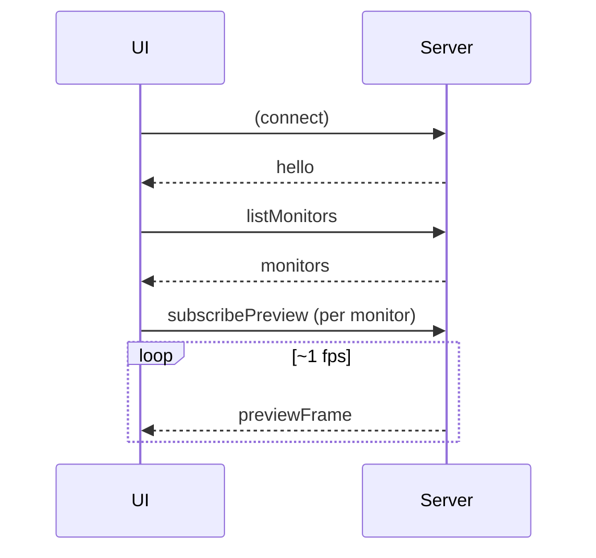

# WebSocket protocol

The UI and daemon speak JSON over a single WebSocket (`ws://localhost:8787`). Every message is defined as a zod schema in `packages/shared/src/protocol.ts`, and both sides parse against those schemas — a malformed message is rejected, not guessed at.

## Envelope and conventions

Every message has a `type` discriminant. Request/response pairs carry an optional `id` that the response echoes, so the UI can correlate a reply with its request. Server-initiated events (previews, triggers, decisions) have no `id`.

```ts
// The two top-level unions, both zod discriminated unions:
type ClientMessage = /* UI → daemon */;
type ServerMessage = /* daemon → UI */;

function decodeClientMessage(raw: string): ClientMessage; // throws on invalid
function decodeServerMessage(raw: string): ServerMessage;
function encodeMessage(message: ClientMessage | ServerMessage): string;
```

Adding a message means adding a variant to the relevant union and handling it in `apps/server/src/handlers.ts` (server) and `apps/ui/src/ws/useServer.ts` (client). TypeScript's exhaustiveness checking flags every place that needs updating — a missing case is a compile error, not a runtime surprise.

## Client → Server

| Message              | Purpose                                             |
| -------------------- | --------------------------------------------------- |
| `listMonitors`       | Ask for the monitor list.                           |
| `listProfiles`       | Ask for all saved profiles.                         |
| `saveProfile`        | Persist a profile (create or update).               |
| `deleteProfile`      | Remove a profile.                                   |
| `start`              | Start the engine on a profile.                      |
| `stop`               | Stop the engine.                                    |
| `setDryRun`          | Toggle dry-run on the running engine.               |
| `captureBaseline`    | Snapshot a region rect as a baseline image.         |
| `subscribePreview`   | Begin receiving preview frames for a monitor.       |
| `unsubscribePreview` | Stop preview frames for a monitor.                  |
| `testActions`        | Run one region's actions once (respecting dry-run). |
| `listStrategies`     | Ask for all strategies.                             |
| `saveStrategy`       | Persist a strategy (markdown + metadata).           |
| `deleteStrategy`     | Remove a strategy.                                  |
| `uploadAttachment`   | Upload a base64 file to a strategy.                 |
| `deleteAttachment`   | Remove an attachment.                               |
| `probeLlm`           | Test provider connectivity without a generation.    |
| `testDecision`       | Run one LLM decision now, without executing it.     |

## Server → Client

| Message            | Purpose                                                                                                                                                                                                                      |
| ------------------ | ---------------------------------------------------------------------------------------------------------------------------------------------------------------------------------------------------------------------------- |
| `hello`            | Sent on connect: server version + current engine state.                                                                                                                                                                      |
| `monitors`         | The monitor list (with per-monitor capture size and scale).                                                                                                                                                                  |
| `profiles`         | The full profile list.                                                                                                                                                                                                       |
| `strategies`       | The full strategy list.                                                                                                                                                                                                      |
| `engineState`      | Running/dry-run/profile/kill-switch state — broadcast on every transition.                                                                                                                                                   |
| `previewFrame`     | One JPEG frame for a subscribed monitor.                                                                                                                                                                                     |
| `baselineCaptured` | A captured baseline (id + PNG) in reply to `captureBaseline`.                                                                                                                                                                |
| `attachmentSaved`  | Confirmation of an uploaded attachment.                                                                                                                                                                                      |
| `regionStatus`     | A region's live match/state, throttled to changes.                                                                                                                                                                           |
| `triggered`        | A region fired; carries the steps it would run.                                                                                                                                                                              |
| `llmProbe`         | The result of a `probeLlm`.                                                                                                                                                                                                  |
| `llmDecision`      | A model decision: observation, reasoning, confidence, translated steps, whether executed, and why not if skipped. Also carries the sent screenshots (base64 JPEG per monitor) and capture-pixel click markers for debugging. |
| `killSwitch`       | The engine was halted by the hotkey or corner failsafe.                                                                                                                                                                      |
| `log`              | A human-readable log line (info/warn/error).                                                                                                                                                                                 |
| `error`            | An error, echoing the request `id` when there was one.                                                                                                                                                                       |
| `ack`              | Generic success acknowledgement.                                                                                                                                                                                             |

## Typical exchanges

**Connecting.** On connect the server sends `hello`; the UI immediately requests `listMonitors` and `listProfiles`, then subscribes to previews for each monitor.



**Running in LLM mode.** After `start`, the server broadcasts `engineState`, then streams `regionStatus`, `triggered`, and `llmDecision` events as the loop runs. Every connected UI receives the broadcasts, so multiple tabs stay in sync.

## Design notes

- **Broadcasts vs replies.** Mutations (`saveProfile`, `saveStrategy`, `start`, …) reply to the caller with `ack`/`error` _and_ broadcast the resulting list/state to everyone, so all connected clients converge.
- **Previews are base64 JPEG** inside the JSON envelope. At ~1 fps on localhost this is fine; the frame message is structured so it could move to binary WebSocket frames later without touching the rest of the protocol.
- **Attachments are base64** in `uploadAttachment`, with the decoded size capped server-side.
- **The router is pure-ish and tested.** `handleMessage(ctx, client, message)` takes a context of injected dependencies, which lets `handlers.test.ts` drive every message type with fakes and assert the replies and broadcasts.
