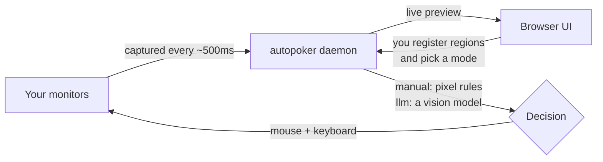

# What is autopoker?

autopoker is a desktop-automation tool for Windows. A small background program (the **daemon**) captures your screens on a timer and can move the mouse, click, and type. A browser-based **UI** is where you set it all up and watch it run.

It works in one of two modes, and you switch between them per profile with a single toggle:

| Mode       | Who decides what to do                                          | When to use it                                                                                                                      |
| ---------- | --------------------------------------------------------------- | ----------------------------------------------------------------------------------------------------------------------------------- |
| **Manual** | Rules you define — "when this region turns red, click here"     | Repetitive, well-defined triggers you can describe with a pixel condition. Also the fastest way to test that clicking works at all. |
| **LLM**    | A vision model, following a strategy you write in plain English | Situations too varied to script — the model looks at the screenshot, reads your strategy, and decides.                              |

Both modes run through the exact same execution pipeline, so everything that keeps you safe — dry-run, the kill switch, cooldowns, the one-thing-at-a-time action queue — applies identically whether a pixel rule or a model made the decision.

## The shape of a session

You never edit config files by hand. You open the UI, drag rectangles over the things that matter on your screen, and either attach actions to them (manual) or describe a strategy and let a model act (LLM).

## What it is not

- **Not** a headless bot framework — it drives your real, visible desktop. The mouse pointer actually moves.
- **Not** cloud-hosted — the daemon runs on your machine. In LLM mode the _only_ thing that leaves your machine is the screenshot and strategy you send to a cloud provider, and only if you choose a cloud provider over local Ollama.
- **Not** safe to point at anything important while you learn it. Start in dry-run, on a throwaway window.

## Where to go next

- New here? **[Getting started](./getting-started)** gets the daemon and UI running in a couple of minutes.
- Want the model to play for you? **[LLM mode](./llm-mode)** and **[Writing strategies](./strategies)**.
- Want to script fixed triggers? **[Manual mode](./manual-mode)**.
- Building on it or curious how it works? The **[Developer guide](/dev/)**.

::: warning A note on responsible use
autopoker automates a real computer. Only use it where automation is allowed. Many games and online services prohibit automated play and can ban accounts for it — that is your call to make, not the tool's.
:::
