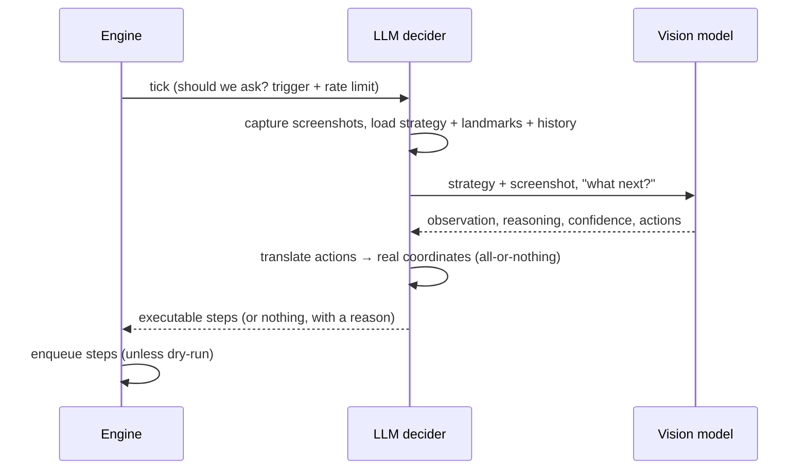

# LLM mode

In LLM mode, autopoker sends a screenshot of your screens — together with a strategy you wrote — to a vision model, and the model decides the next action. It's for situations too varied to capture with pixel rules.

Switch to it in the **model** tab: set the mode to **LLM decides**, pick a provider and model, and choose a strategy.

## The decision loop

The model never touches your mouse directly. It returns a structured decision; autopoker validates it, translates it into concrete steps, checks it against your safety limits, and only then — if you're live — executes it.

## What the model gets

On each consultation the model receives:

- **your strategy** — the markdown, plus any attachments (images, PDFs, text). See [Writing strategies](./strategies).
- **screenshots** — if any [view region](./regions#regions) is enabled, only those crops are sent (much faster). Otherwise, every screen ticked under **screens to send** in the model tab; by default all monitors. If nothing is selected, the model is blind and the event log warns you.
- **the landmarks** — every enabled automate/landmark region's name, description, and location, so it can click them by name.
- **its decision log** — a timestamped list of its own recent decisions, _including_ waits and skipped ones, each honestly marked with whether it actually ran. This is the model's memory of the current hand: what it observed a few turns ago is how it knows what already happened this round. The **history** setting controls how many entries are kept (default 8) — for turn-based games set it to comfortably cover a full round of action.
- **what just changed** — if a region condition fired this tick, the model is told which one.

::: tip Why text history instead of past screenshots?
Sending the last N images would multiply the vision cost — the slowest part of every call — by N. Instead the model's own observations are replayed as text, which is nearly free. This also means observations matter: a strategy that tells the model to note stacks, bets, and positions in its observation gives its future self better memory.
:::

## Landmarks: precision without trusting the model's aim

Vision models are unreliable at naming exact pixel coordinates. autopoker sidesteps this: set a region's **purpose** to _landmark_, give it a clear **description**, and the model clicks it _by name_. autopoker resolves that name to the region's centre and maps it to real screen coordinates.

So the region editor you use for manual testing is also what makes autonomous mode accurate. The model still _may_ return raw coordinates when nothing else fits, but names are always preferred.

::: tip
Give landmarks descriptive names and descriptions. "Fold button" with description "the fold button, bottom-left of the table" is far more reliable than "button1".
:::

## Making it fast

For near-real-time play (not timing out on your turn), attack latency in this order:

1. **Draw a view region** around just the game window. Vision cost scales with pixels; a 900×700 crop of a 2560×1440 desktop is roughly a fifth of the work per call.
2. **Avoid the reasoning trace.** Thinking models produce a long hidden trace before every answer — often the single largest share of the response time. Prefer a non-thinking build (`qwen3-vl:32b-instruct` rather than `qwen3-vl:32b`); the **thinking: off** setting works only on hybrid models and makes thinking-only builds return empty decisions. See [Model providers](./providers#local-models-with-ollama).
3. **Trigger on a region, not every tick.** A cheap pixel rule that detects "it's my turn" (an automate-purpose region watching the action buttons appear) wakes the model only when a decision is actually needed.
4. **Keep landmarks for the buttons** so the model answers with short, precise `clickRegion` actions instead of coordinates.
5. **Lower max tokens** if decisions are consistently short.

## When the model is consulted

Two settings control this, and they matter enormously for cost:

- **trigger**:
  - _when a region condition fires_ (default) — a cheap pixel rule detects "it's my turn", and only then is the model asked. Recommended.
  - _every tick_ — the model is consulted continuously. Powerful but expensive.
- **min gap ms** — a hard floor between consultations, regardless of trigger. This is your primary cost control.

Only one model call is ever in flight at a time. The engine waits for a decision before ticking again, so a slow model slows the loop rather than stacking up concurrent (and costly) calls.

## Tuning: "ask the model once"

The **ask the model once** button in the model tab is the loop you'll live in while dialling a strategy in. It captures the selected screens right now, asks the model, and shows you:

- what the model **saw** (its observation),
- **why** it chose what it did (its reasoning against your strategy),
- its **confidence**,
- the exact **steps** the decision translated into,
- token usage,
- **the screenshots that were actually sent** — click a thumbnail to open it full-size. Red crosshairs mark exactly where the model's clicks would land, so you can verify its aim before ever going live. This works for skipped and failed decisions too.

It **never executes** — it's purely diagnostic. While the request is in flight the button shows a spinner (local models can take tens of seconds); the decision card appears when the answer lands. Iterate on your strategy markdown until the decisions look right, _then_ start the engine in dry-run, _then_ go live.

## Safety in LLM mode

Every guard from manual mode applies, plus decision-specific ones:

- **dry-run** still asks the model and shows its decision — it just doesn't execute it.
- **min confidence** (default 0.5) — decisions the model is less sure about than this are displayed but never executed. Models that report confidence as a percentage (e.g. `90`) are read as the fraction (`0.90`) rather than rejected.
- **max actions** (default 4) — a decision proposing more steps than this is rejected outright, not partially run.
- **all-or-nothing translation** — if the model names a region that doesn't exist, or gives an off-screen coordinate, the _entire_ decision is thrown out rather than half-executed. Half of a plan ("click Raise, type 100, press Enter") is more dangerous than none of it.

See [Safety](./safety) for everything, and [Model providers](./providers) for choosing and configuring a model.
