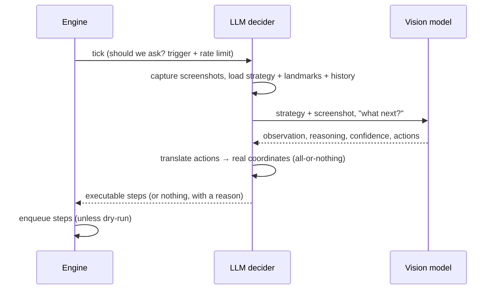

# LLM mode

In LLM mode, autopoker sends a screenshot of each relevant monitor — together with a strategy you wrote — to a vision model, and the model decides the next action. It's for situations too varied to capture with pixel rules.

Switch to it in the **model** tab: set the mode to **LLM decides**, pick a provider and model, and choose a strategy.

## The decision loop

The model never touches your mouse directly. It returns a structured decision; autopoker validates it, translates it into concrete steps, checks it against your safety limits, and only then — if you're live — executes it.

## What the model gets

On each consultation the model receives:

- **your strategy** — the markdown, plus any attachments (images, PDFs, text). See [Writing strategies](./strategies).
- **a screenshot** of each monitor that has regions on it.
- **the landmarks** — every enabled region's name, description, and location, so it can click them by name.
- **recent history** — a short list of its own previous decisions, so it stays coherent turn to turn.
- **what just changed** — if a region condition fired this tick, the model is told which one.

## Landmarks: precision without trusting the model's aim

Vision models are unreliable at naming exact pixel coordinates. autopoker sidesteps this: set a region's **purpose** to _landmark_, give it a clear **description**, and the model clicks it _by name_. autopoker resolves that name to the region's centre and maps it to real screen coordinates.

So the region editor you use for manual testing is also what makes autonomous mode accurate. The model still _may_ return raw coordinates when nothing else fits, but names are always preferred.

::: tip
Give landmarks descriptive names and descriptions. "Fold button" with description "the fold button, bottom-left of the table" is far more reliable than "button1".
:::

## When the model is consulted

Two settings control this, and they matter enormously for cost:

- **trigger**:
  - _when a region condition fires_ (default) — a cheap pixel rule detects "it's my turn", and only then is the model asked. Recommended.
  - _every tick_ — the model is consulted continuously. Powerful but expensive.
- **min gap ms** — a hard floor between consultations, regardless of trigger. This is your primary cost control.

Only one model call is ever in flight at a time. The engine waits for a decision before ticking again, so a slow model slows the loop rather than stacking up concurrent (and costly) calls.

## Tuning: "ask the model once"

The **ask the model once** button in the model tab is the loop you'll live in while dialling a strategy in. It captures a screenshot right now, asks the model, and shows you:

- what the model **saw** (its observation),
- **why** it chose what it did (its reasoning against your strategy),
- its **confidence**,
- the exact **steps** the decision translated into,
- token usage.

It **never executes** — it's purely diagnostic. Iterate on your strategy markdown until the decisions look right, _then_ start the engine in dry-run, _then_ go live.

## Safety in LLM mode

Every guard from manual mode applies, plus decision-specific ones:

- **dry-run** still asks the model and shows its decision — it just doesn't execute it.
- **min confidence** (default 0.5) — decisions the model is less sure about than this are displayed but never executed.
- **max actions** (default 4) — a decision proposing more steps than this is rejected outright, not partially run.
- **all-or-nothing translation** — if the model names a region that doesn't exist, or gives an off-screen coordinate, the _entire_ decision is thrown out rather than half-executed. Half of a plan ("click Raise, type 100, press Enter") is more dangerous than none of it.

See [Safety](./safety) for everything, and [Model providers](./providers) for choosing and configuring a model.
