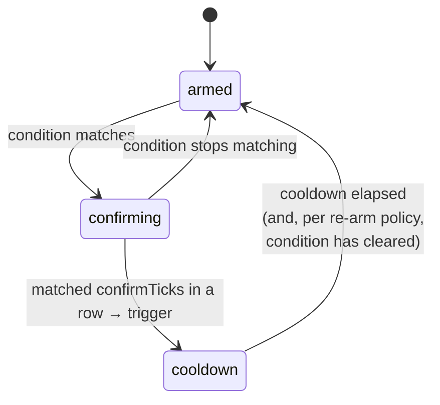

# Manual mode

Manual mode is the default. No model is called — regions watch their own patch of screen and run their own actions when a condition matches. It's deterministic, fast, and free.

Use it when the trigger is something you can describe with pixels: a button that appears, an indicator that turns a colour, a region that changes. If you find yourself unable to express "when should this act?" as a pixel condition, that's the signal to reach for [LLM mode](./llm-mode) instead.

## How a tick works

Every ~500ms (the profile's `intervalMs`), the engine:

1. captures each monitor that has enabled regions on it,
2. crops each region out of its monitor's frame,
3. evaluates the region's [condition](./regions#conditions),
4. advances that region's state machine,
5. for any region that _triggered_ this tick, enqueues its actions (unless dry-run).

The `confirming` stage is the debounce (`confirmTicks`); `cooldown` is the rate limit and re-arm gate. Together they stop a single visible button from being clicked dozens of times a second.

## Building a manual automation

1. Draw a region over the thing to watch.
2. Set its **purpose** to _automate_ (the default).
3. Pick a **condition** that describes when it should act. For "a button appeared", _looks like baseline_ with a captured snapshot is usually the most robust; for "this light turned green", _color at point_ is simplest.
4. Add the **actions** to run — typically a single click, but any sequence works.
5. Tune **confirm ticks**, **cooldown**, and **re-arm** so it fires exactly as often as you want.
6. Save, start in dry-run, and confirm the event log shows triggers at the right moments.
7. Flip to LIVE.

## Testing a region in isolation

The **test actions** button in the region editor runs just that region's action list once, immediately, respecting the current dry-run setting. It's the fastest way to confirm a click lands where you intend without waiting for the condition to fire naturally. In dry-run it logs what would happen; live, it actually does it.

## Worked example: click a "Continue" button whenever it appears

- **Region**: draw it tightly around the button.
- **Purpose**: automate.
- **Condition**: _looks like baseline_. Capture the baseline while the button is visible, set `maxDiffPercent` to about 3–5 so minor rendering differences don't break the match.
- **Action**: a single left click at region centre.
- **Timing**: `confirmTicks` 2 (avoid a one-frame flicker), `cooldownMs` 3000, re-arm _after condition clears_ (so it waits for the button to disappear and reappear before clicking again).

Start in dry-run, watch a couple of appearances trigger correctly, then go live.

## When manual mode isn't enough

Manual rules answer _"has this specific thing happened?"_. They can't answer _"given everything on screen, what's the smart move?"_ — that requires judgement across the whole image. That's exactly the boundary where you switch the profile to LLM mode and hand the decision to a model, while keeping your regions around as **landmarks** for it to click. Continue to [LLM mode](./llm-mode).
